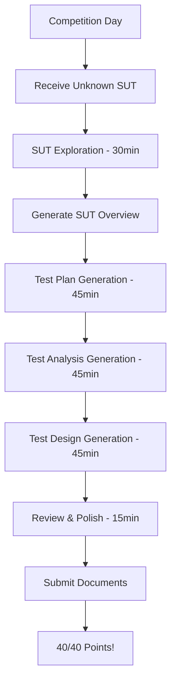

# 🏆 ISTQB Testing Cup - Automation Aid

**Grand Finals Documentation Generator**

[](https://www.istqb.org/)
[](https://github.com/)
[](https://github.com/)

---

## 📋 Competition Overview

**Event:** ISTQB Testing Cup Grand Finals  
**Date:** October 20th, 2025  
**Location:** Copenhagen, Denmark  
**Team:** Automation Aid

### Team Members
- **Team Lead:** Slav Astinov
- **Test Lead:** Sava Barbarov

### Achievement
🥇 **Winners of ISTQB Testing Cup Bulgaria** - advancing to compete in the Grand Finals

---

## 🎯 Project Mission

This project provides an **automated documentation generation framework** for producing comprehensive testing documentation within tight competition time constraints.

### Competition Challenge
- Analyze an **unknown System Under Test (SUT)** revealed on competition day
- Generate professional **Test Plan, Test Analysis, and Test Design** documents
- Maximize scoring points (**40 points total** - 20 per document category)
- Deliver competition-ready documentation in **~3 hours**

---

## 🏗️ Project Structure

```
Playwright-mcp/
├── 📄 PROJECT-SYSTEM-MESSAGE.md    # Competition instructions & standards
├── 📄 README.md                     # This file
├── 📁 SUT-Overview-Generator/       # SUT analysis & exploration
│   └── SUT-Overview-Generation-Prompt.md
├── 📁 Test-Plan/                    # Test Plan generation resources
│   ├── Test-Plan-Generation-Prompt.md
│   └── test-plan-knowledge-base.md
├── 📁 Test-Analysis/                # Test Analysis generation resources
│   ├── Test-Analysis-Generation-Prompt.md
│   └── test-analysis-knowledge-base.md
├── 📁 Test-Design/                  # Test Design generation resources
│   ├── Test-Design-Generation-Prompt.md
│   └── test-design-knowledge-base.md
├── 📁 Documents/                    # Templates & reference materials
│   ├── template.html               # HTML document template
│   └── exploration.json            # Sample exploration data
├── 📁 k6/                           # Performance load testing toolkit
│   ├── basic-load-test.js          # Simple endpoint testing template
│   ├── spike-test.js               # Traffic surge simulation
│   ├── stress-test.js              # Breaking point finder
│   ├── api-rest-test.js            # Multi-endpoint API testing
│   ├── scenario-based-test.js      # Realistic user behavior scenarios
│   ├── soak-test.js                # Long-term stability testing
│   ├── utils.js                    # Helper functions & data generation
│   ├── config.js                   # Configuration template
│   ├── AI_AGENT_PROMPT.md          # K6 knowledge base for AI agents
│   └── README.md                   # Quick reference guide
├── 📁 playwright-base-project/     # AI-powered test automation framework
│   ├── page-objects/               # Page Object Models (POM)
│   ├── tests/                      # Test specifications
│   ├── test-data/                  # Test data files
│   ├── helpers/                    # Utility functions
│   ├── playwright.config.ts        # Playwright configuration
│   ├── README.md                   # Complete framework documentation
│   ├── QUICK-START.md              # Instant automation template
│   ├── AUTOMATION-TRIGGER-PROMPT.md # AI automation guide
│   └── AUTOMATION-REFERENCE-CARD.md # Quick reference patterns
└── 📁 Archive/                      # Generated competition documents
    ├── CURA-Healthcare-*.html      # Practice documentation
    └── A1-Club-*.md               # Practice documentation
```

---

## 🎭 Playwright Test Automation Framework

### Purpose
**AI-Powered Test Generation** for rapid SUT validation and test case execution during competition.

### Competition Integration
- **SUT Exploration:** Use Playwright-MCP to interactively explore the unknown SUT
- **Automated Test Creation:** AI generates page objects, test data, and test specs from live application
- **Real Selector Capture:** Captures actual DOM elements from browser, not assumptions
- **Test Case Execution:** Validates test design with executable automation

### Key Features
| Feature | Benefit |
|---------|---------|
| **AI-Powered Generation** | Provide URL + credentials → Get complete test automation |
| **Page Object Model** | Maintainable, reusable test components |
| **Real Browser Exploration** | Playwright-MCP captures actual selectors from live app |
| **TypeScript + Best Practices** | Production-ready, type-safe code |
| **Multi-Browser Support** | Chromium, Firefox, WebKit |
| **Rich Reporting** | HTML reports with traces, screenshots, videos |

### Competition Workflow
```bash
# Quick automation for unknown SUT:
1. Receive SUT URL and credentials
2. Use QUICK-START.md template → Paste URL + credentials + test case
3. AI explores SUT with Playwright-MCP browser
4. Auto-generates: Page Objects + Test Data + Test Specs
5. Execute tests to validate Test Design
6. Include test reports as supporting artifacts
# Total time: ~15-30 minutes per test scenario
```

### Documentation
- **[playwright-base-project/README.md](./playwright-base-project/README.md)** - Complete framework guide (14.8 KB)
- **[QUICK-START.md](./playwright-base-project/QUICK-START.md)** - Copy-paste automation template
- **[AUTOMATION-TRIGGER-PROMPT.md](./playwright-base-project/AUTOMATION-TRIGGER-PROMPT.md)** - Detailed AI guide

### Example Output Structure
After automating a test case, generates:
```
page-objects/[SUT]/
├── LoginPage.ts              # Login interactions
├── DashboardPage.ts          # Dashboard elements
└── [Feature]Page.ts          # Feature-specific pages

test-data/
├── [sut]-credentials.json    # Login credentials
└── [sut]-testdata.json       # Test data

tests/
└── TC-[ID]-[description].spec.ts  # Executable test case
```

### Value Proposition
✅ **Speed** - Minutes, not hours, to create executable tests  
✅ **Quality** - Real selectors from live application  
✅ **Coverage** - Validates Test Design with automation  
✅ **Evidence** - Test execution reports for deliverables  

**See:** [playwright-base-project/](./playwright-base-project/) for complete documentation.

---

## 🔧 Technology Stack

### Core Automation Tools

| Tool | Purpose | Usage |
|------|---------|-------|
| **Playwright MCP** | SUT exploration & analysis | Browser automation, UI interaction, workflow analysis |
| **OWASP ZAP** | Security testing | Vulnerability scanning, penetration testing |
| **Google Lighthouse** | Accessibility testing | WCAG compliance, accessibility audits |
| **K6** | Performance testing | Load testing, performance benchmarking |
| **Cursor + Claude** | AI-assisted documentation | Test case generation, intelligent analysis |
| **n8n** | Workflow automation | Test execution pipelines, report generation |

### Development Environment
- **Package Manager:** pnpm (v8.15.8)
- **Runtime:** Node.js
- **AI Assistant:** Claude Sonnet 4.5 (via Cursor)
- **VCS:** Git

---

## 🚀 Quick Start

### Prerequisites
```bash
# Ensure pnpm is installed
corepack enable
corepack prepare pnpm@8.15.8 --activate
```

### Installation
```bash
# Clone the repository
git clone <repository-url>
cd Playwright-mcp

# Install dependencies (if package.json exists)
pnpm install
```

### Competition Day Workflow

#### Phase 1: SUT Discovery (30 minutes)
```bash
# 1. Receive SUT URL and credentials from organizers
# 2. Execute SUT exploration using Playwright MCP
# 3. Generate comprehensive SUT Overview document
```

Follow the process in `SUT-Overview-Generator/SUT-Overview-Generation-Prompt.md`

#### Phase 2: Test Plan Generation (45 minutes)
```bash
# 1. Analyze SUT Overview for risk identification
# 2. Define comprehensive scope and timeline
# 3. Generate Test Plan HTML document
```

Follow the process in `Test-Plan/Test-Plan-Generation-Prompt.md`  
Reference: `Test-Plan/test-plan-knowledge-base.md`

#### Phase 3: Test Analysis Generation (45 minutes)
```bash
# 1. Focus on high-risk features
# 2. Create detailed test conditions
# 3. Generate Test Analysis HTML document
```

Follow the process in `Test-Analysis/Test-Analysis-Generation-Prompt.md`  
Reference: `Test-Analysis/test-analysis-knowledge-base.md`

#### Phase 4: Test Design Generation (45 minutes)
```bash
# 1. Design comprehensive test cases
# 2. Apply test design techniques
# 3. Generate Test Design HTML document
```

Follow the process in `Test-Design/Test-Design-Generation-Prompt.md`  
Reference: `Test-Design/test-design-knowledge-base.md`

#### Phase 5: Review & Polish (15 minutes)
```bash
# Final quality check and document refinement
```

---

## 📊 Scoring Criteria

### Test Plan Quality (20 points)

**Success Factors:**
- ✅ Comprehensive coverage of product risks
- ✅ Clear scope and realistic time management
- ✅ Systematic approach with tool usage
- ❌ Avoid: Focusing only on one test type or unworkable schedules

### Test Analysis & Design (20 points)

**Success Factors:**
- ✅ Focus on high-risk features
- ✅ Well-defined test conditions, cases, and charters
- ✅ Prioritization and traceability
- ❌ Avoid: Missing basic tests or designing more than executable

**Target Score:** 40/40 points (Perfect score)

---

## 📝 Document Standards

### HTML Template
All documentation uses the professional HTML template located at `Documents/template.html`

### Required Document Headers
```html
Team Name: Automation Aid
Competition: ISTQB Testing Cup Grand Finals
Date: October 20th, 2025
Location: Copenhagen, Denmark
Team Lead: Slav Astinov
Test Lead: Sava Barbarov
```

### Quality Standards
- **Comprehensive Coverage:** Address all scoring criteria
- **Risk-Based Approach:** Prioritize high-risk areas
- **Practical Implementation:** Ensure executability
- **Professional Quality:** Competition-grade standards

---

## 🎖️ Competitive Advantages

### Automation Aid Team Strengths
1. **Systematic Approach** - Proven methodology for rapid SUT analysis
2. **Tool Mastery** - Advanced Playwright MCP automation capabilities
3. **Knowledge Integration** - Comprehensive testing knowledge bases
4. **Documentation Excellence** - Professional HTML template design
5. **Risk Focus** - Strategic risk-based testing approach

### Innovation Edge
- AI-assisted documentation generation with Cursor + Claude
- Automated SUT exploration with Playwright MCP
- Multi-tool integration strategy (security, performance, accessibility)
- Workflow automation with n8n

---

## ⚡ K6 Performance Testing Integration

### Purpose in Competition
K6 provides **rapid performance baseline establishment** for the unknown SUT, supporting Test Plan risk analysis and Test Design performance test cases.

### Competition Workflow
1. **Endpoint Discovery** (via Playwright MCP) - Capture network requests during SUT exploration
2. **Template Selection** - Choose appropriate K6 test type (API/spike/stress/scenario)
3. **Quick Customization** - Update BASE_URL and discovered endpoints (5 minutes)
4. **Execution** - Run load tests to establish performance baselines (2-5 minutes)
5. **Report Generation** - Auto-generated `summary.html` with professional metrics and graphs

### K6 Test Templates Ready for Competition

| Template | Competition Use Case | Execution Time |
|----------|---------------------|----------------|
| `basic-load-test.js` | Quick API health check | 30 seconds |
| `api-rest-test.js` | Multi-endpoint performance baseline | 2 minutes |
| `spike-test.js` | Resilience testing for Test Plan risks | 40 seconds |
| `stress-test.js` | Find breaking points for capacity planning | 4.5 minutes |
| `scenario-based-test.js` | Realistic user behavior simulation | 2 minutes |

### Performance Reports Output
- **HTML Reports** - Professional `summary.html` with graphs, metrics, and pass/fail thresholds
- **Key Metrics** - Response times (p95, p99), error rates, throughput, concurrent users
- **Thresholds** - Configurable pass/fail criteria for Test Plan inclusion
- **Evidence** - Competition-ready performance test documentation

### Playwright MCP + K6 Integration
```bash
# Competition Day Quick Flow:
1. Playwright MCP → Discover endpoints (5 min)
2. Update K6 template with discovered URLs (2 min)
3. Run: k6 run --vus 10 --duration 2m api-rest-test.js (2 min)
4. Include summary.html in supporting artifacts (instant)
# Total: ~10 minutes for complete performance test evidence
```

---

## 📚 Knowledge Base Resources

### Generation Prompts
- `SUT-Overview-Generator/SUT-Overview-Generation-Prompt.md` - SUT analysis methodology
- `Test-Plan/Test-Plan-Generation-Prompt.md` - Test Plan creation guide
- `Test-Analysis/Test-Analysis-Generation-Prompt.md` - Test Analysis creation guide
- `Test-Design/Test-Design-Generation-Prompt.md` - Test Design creation guide

### Knowledge Bases
- `Test-Plan/test-plan-knowledge-base.md` - Test planning best practices
- `Test-Analysis/test-analysis-knowledge-base.md` - Test analysis techniques
- `Test-Design/test-design-knowledge-base.md` - Test design patterns

### Templates & Standards
- `Documents/template.html` - Professional HTML document template
- `PROJECT-SYSTEM-MESSAGE.md` - Complete competition instructions

---

## 🔄 Workflow Summary



---

## 📦 Deliverables

### Competition Outputs
1. **SUT Overview Document** - Foundation analysis (Markdown)
2. **Test Plan Document** - Strategic testing approach (HTML)
3. **Test Analysis Document** - Detailed test conditions (HTML)
4. **Test Design Document** - Comprehensive test cases (HTML)

### Supporting Artifacts
- **OWASP ZAP** security test reports
- **K6** performance test reports (`summary.html` - auto-generated HTML reports with metrics, graphs, and thresholds)
- **Lighthouse** accessibility reports
- **Playwright** automation scripts (GitHub repository)

---

## 🎯 Success Metrics

### Target Outcomes
- ✅ Test Plan Quality: **20/20 points**
- ✅ Test Analysis & Design: **20/20 points**
- ✅ **Total: 40/40 points (Perfect Score)**

### Quality Indicators
- ✅ All scoring criteria thoroughly addressed
- ✅ Risk-based approach consistently applied
- ✅ Professional, competition-ready documentation
- ✅ Executable and practical recommendations
- ✅ Consistent design across all documents

---

## 🤝 Contributing

This is a competition project for the **Automation Aid** team. The framework and approach can be adapted for:
- ISTQB certification training
- Rapid test documentation generation
- Testing methodology demonstrations
- Educational purposes

---

## 📄 License

This project is maintained by the **Automation Aid** team for the ISTQB Testing Cup Grand Finals.

---

## 📞 Contact

**Team:** Automation Aid  
**Team Lead:** Slav Astinov  
**Test Lead:** Sava Barbarov  
**Competition:** ISTQB Testing Cup Grand Finals 2025  
**Location:** Copenhagen, Denmark

---

## 🏁 Mission Statement

> *"Deliver exceptional testing documentation that demonstrates mastery of ISTQB principles, innovative automation approaches, and professional excellence worthy of the ISTQB Testing Cup Grand Finals."*

**Go Automation Aid! 🚀**

---

**Document Version:** 1.0  
**Last Updated:** January 2025  
**Purpose:** Competition Framework Documentation  
**Status:** Grand Finals Ready ✅

